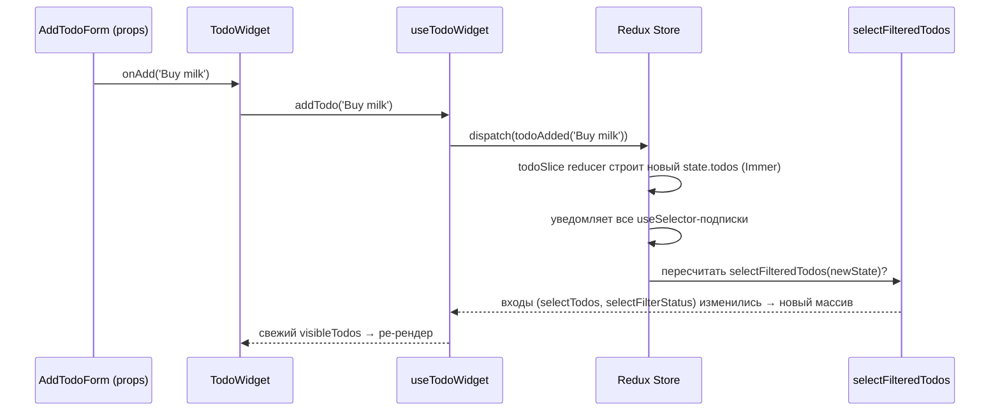

# Composite-хук виджета (facade hook)

> Продолжение [Redux setup](./redux-setup.md): по code review логику из `AddTodoForm`/`TodoFilter`/`TodoList` собрали в один виджет `TodoWidget` с одним хуком-фасадом `useTodoWidget`.

## Проблема

После «Redux setup» подключёнными (connected) были сразу три компонента: `AddTodoForm`, `TodoFilter`, бывший widget `TodoList`. Каждый сам вызывал `useAppSelector`/`useAppDispatch`. Ревью подсветило: «move all logic to the widget» — то есть вся логика должна жить в одном месте, а не быть размазанной по трём компонентам одного экрана.

## Решение: один composite-хук + тупые дети

```
widgets/todo/
  model/
    useTodoWidget.ts   ← «мозг» виджета: весь стор в одном месте
  ui/
    TodoWidget/
      TodoWidget.tsx   ← connected; рендерит форму + фильтр + список
      TodoWidget.stories.tsx
  index.ts
```

`useTodoWidget` — единственная точка входа в стор для всего экрана:

```ts
// widgets/todo/model/useTodoWidget.ts
export const useTodoWidget = () => {
  const dispatch = useAppDispatch();
  const visibleTodos = useAppSelector(selectFilteredTodos); // деривация — то, что рендерится
  const filterStatus = useAppSelector(selectFilterStatus);

  const addTodo = (text: string) => dispatch(todoAdded(text));
  const toggleTodo = (id: string) => dispatch(todoToggled(id));
  const deleteTodo = (id: string) => dispatch(todoDeleted(id));
  const setFilter = (status: FilterStatus) => dispatch(filterChanged(status));

  return { visibleTodos, filterStatus, addTodo, toggleTodo, deleteTodo, setFilter };
};
```

`TodoWidget` вызывает **только этот** хук и раздаёт колбэки/данные вниз пропсами. `AddTodoForm`, `TodoFilter`, `TodoItem` снова презентационные — ни один не знает про Redux.

## Три выигрыша

1. **Логика — в виджете.** `useTodoWidget` — это «мозг»; сам `TodoWidget` — только разметка и проброс пропсов.
2. **Дети снова тупые.** `AddTodoForm`/`TodoFilter` берут `onAdd`/`status`+`onChange` пропсами → их stories снова тривиальны (`args`, без `preloadedState`/Provider-конфигурации). Стор нужен только story `TodoWidget`.
3. **Один шов для смены менеджера.** Redux → Zustand/MobX — переписывается только тело `useTodoWidget`. Компоненты не трогаем (см. оговорку про MobX ниже).

## Почему один хук, а не два (entity + feature)

Два отдельных хука (`useTodoEntity` + `useTodoFilter`) имеют смысл когда **под-компоненты сами connected** и каждый читает свой кусок стора независимо — это был как раз вариант «Redux setup». Но с `TodoWidget` мы делаем обратное: **централизуем** всё в одном месте. Два хука + composite-обёртка поверх них — лишний слой ради того же результата. Для «вся логика в виджете» проще и честнее один composite-хук.

## Сырой vs фильтрованный список — граница не меняется

Facade-хук ничего не меняет в устройстве селекторов:

- [selectTodos](../src/entities/todo/model/selectors.ts) — сырой список, остаётся в `entities/todo` (сущность знает только свои данные).
- [selectFilteredTodos](../src/features/filter-todos/model/selectors.ts) — деривация (мемо через `createSelector`), остаётся в `features/filter-todos` (знает и про todos, и про фильтр).

`useTodoWidget` наружу отдаёт `visibleTodos` (уже отфильтрованный — это то, что рендерит список). Сырой `items` виджету не нужен, поэтому не выставляется.

## Сквозная трассировка: клик «Add» → перерисовка списка

Термины (action, reducer, dispatch, селектор, мемоизация) разобраны в [redux-concepts.md](./redux-concepts.md). Здесь — как они физически связаны цепочкой именно в `TodoWidget`.



Коротко по шагам:

1. `AddTodoForm` не знает про Redux — просто зовёт проп `onAdd(text)`.
2. `TodoWidget` тоже не знает про Redux — просто зовёт то, что вернул хук: `addTodo(text)`.
3. **Только внутри `useTodoWidget`** это превращается в `dispatch(todoAdded(text))` — единственная точка, где вызов `addTodo` становится Redux-действием.
4. Reducer в `todoSlice` строит новый `state.todos` (через Immer), стор уведомляет подписчиков.
5. `useAppSelector(selectFilteredTodos)` внутри `useTodoWidget` пересчитывается: входы (`selectTodos`, `selectFilterStatus`) изменились → `createSelector` возвращает **новый** массив (а не закэшированный).
6. React видит новую ссылку у результата `useSelector` → перерендеривает `TodoWidget` → `visibleTodos` в JSX — свежие.

Тот же путь для фильтра: `TodoFilter` → `onChange(status)` → `setFilter(status)` в хуке → `dispatch(filterChanged(status))` → `state.filter.status` меняется → `selectFilteredTodos` пересчитывается (второй вход изменился) → ре-рендер.

### Почему это работает только благодаря `createSelector`

Если бы `visibleTodos` считался инлайн-фильтрацией на каждый рендер (`allTodos.filter(...)` прямо в `useTodoWidget`), то любой **несвязанный** ре-рендер `TodoWidget` (например, из-за ещё одного `useAppSelector` на не относящийся к делу кусок стора) пересобирал бы `visibleTodos` в новый массив — с тем же содержимым, но с новой ссылкой. Это ломает не сам рендер `TodoWidget` (он и так перерисовался бы), а **нижестоящую мемоизацию**: `React.memo` вокруг списка, `useMemo`/`useEffect(..., [visibleTodos])` — всё это сравнивает по `===` и посчитало бы «изменилось», хотя данные те же. Проблема расползается вниз по дереву компонентов, а не остаётся локальной. `createSelector` держит одну и ту же ссылку, пока входы (`selectTodos`, `selectFilterStatus`) реально не изменились — именно это и делает `visibleTodos` безопасным для передачи в мемоизированных детей.

## Честный трейд-офф

Это осознанный откат connect у `AddTodoForm`/`TodoFilter` из «Redux setup» — они снова получают данные пропсами от `TodoWidget`. Появляется **неглубокий** проп-пассинг (один уровень, `TodoWidget → дети`, внутри одного виджета) — не та боль, от которой уходили prop drilling'ом через весь дерево в [state-management.md](./state-management.md).

Взамен:

- тупые переиспользуемые дети;
- простой Storybook для них (без стора);
- один явный шов (`useTodoWidget`) для будущей замены state-менеджера.

По сути — паттерн **«умный контейнер (`TodoWidget`) + презентационные дети»**: connected-компонент на верхнем уровне виджета, всё остальное — на props. Тот же принцип, что и `pages/home` → `widgets`, только на один уровень ниже.

## Оговорка про MobX

Этот шов ровно один файл только для **hook-based** сторов (Redux, Zustand): их API — это функции/хуки, которые легко завернуть в `useTodoWidget`. MobX устроен иначе — компоненты должны быть обёрнуты в `observer(...)`, чтобы подписаться на реактивные `observable`. Если `TodoItem` тоже должен реагировать на точечные изменения (а не только получать проп и перерендериваться от родителя), его тоже придётся обернуть в `observer`. Facade-хук не отменяет эту особенность MobX — он только не даёт **лишним** компонентам знать про стор напрямую.

## См. также

- [Redux setup (RTK)](./redux-setup.md) — откуда взялись `selectTodos`/`selectFilteredTodos` и connected-компоненты, которые здесь частично откатили
- [Feature-Sliced Design](./fsd-architecture.md) — почему `TodoWidget`, а не два хука в разных слоях
- [State management (обзор и дерево решений)](./state-management.md) — где заканчивается «неглубокий» проп-пассинг и начинается prop drilling
